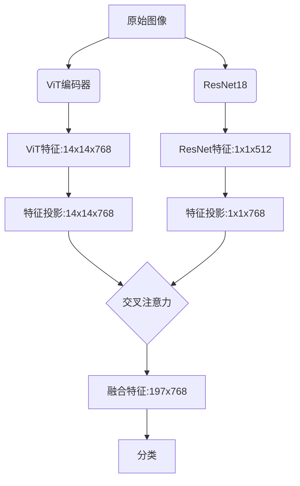

方法
拓展瘤周 （医学）-> 轻量的unet分割瘤内+瘤周区域 + resnet50

包虫病顶刊方法 （医学）


模型改进 （计算机）


数据集
公开数据集 + 自建数据集
输入模型是用原始图像还是掩码输入 -> 对比原始 掩码 掩码+瘤周 （偏医学）


相关工作


数据增强方法 
超分辨率 
（峰值信噪比）PSNR，（结构相似性）SSIM，（局部归一化互相关）LNCC

思路1
数据集 公开数据集 + 自建数据集
输入  轻量的unet得到掩码 （把瘤内和瘤周分割到一块）
方法  resnet50 融合 vit


1 . 复现包虫病方法

标题 多模态特征融合乳腺癌分类

数据集 
GAN 生成补全类别平衡

方法
CNN特征+传统组学特征+Transformer
- CNN特征 几个cnn网络的最后线性层
- 传统组学特征->三步法->20个特征
- 把特征向量拼接起来作为transformer的输入

消融实验 
首先是模型对比
VGG16 做了
Resnet 做了
原始图像 + Transformer   vit-base 做了
CNN特征 + Transformer
CNN特征 + 传统组学特征+Transformer

可加的点
超分或者其他数据增强 
基于医学图像的性质 讨论提取特征时ROI的设计 类似瘤周拓展  好比原始图像时512 /* 512 缩放成256 /* 256时直接等比例缩小 但是可以不直接缩放 利用原图肿瘤的位置往外扩成一个256 /* 256的区域
**病灶聚焦训练**：
加入门控机制 对输入特征加权融合


##### 实验记录
采用早停机制 epoch=5

```python
class Config:
    data_dir = "Dataset_BUSI_with_GT/"  # 数据集路径
    batch_size = 48                    # 根据GPU显存调整
    num_epochs =  100                 # 最大训练轮次
    lr = 1e-4                         # 初始学习率
    weight_decay = 1e-4                # L2正则化
    early_stop_patience = 5           # 早停耐心值
    device = torch.device("cuda:2" if torch.cuda.is_available() else "cpu")
    model_save_path = "./best_model.pth"  # 模型保存路径
```

|     | model                 | 编码器                        | 解码器                    | auc | precision | acc |                                           |
| --- | --------------------- | -------------------------- | ---------------------- | --- | --------- | --- | ----------------------------------------- |
| 0   | vgg16                 |                            |                        | 94  | 93 90     | 86  |                                           |
| 1   | resnet18              |                            |                        | 95  | 94 74     | 85  |                                           |
| 2   | resnet50              |                            |                        | 94  | 94 79     | 86  |                                           |
| 3   | vit-base              |                            |                        | 94  | 91 83     | 88  |                                           |
| 4   | res18+transformer     | res18+ transformer encoder | transformer<br>decoder | 93  | 93 83<br> | 88  |                                           |
| 5   | res18+vit+transformer | res18+vit<br>交叉注意力         | mlp                    | 96  | 94 84     | 91  | 损失函数要分开设计 预训练res和vit模型至最优 冻结 然后训练后后面的分类参数 |
|     |                       |                            |                        |     |           |     |                                           |
|     |                       |                            |                        |     |           |     |                                           |

目前cnn融合vit应该是可行的 后续计划是调参 + GAN生成更多的样本


5:
