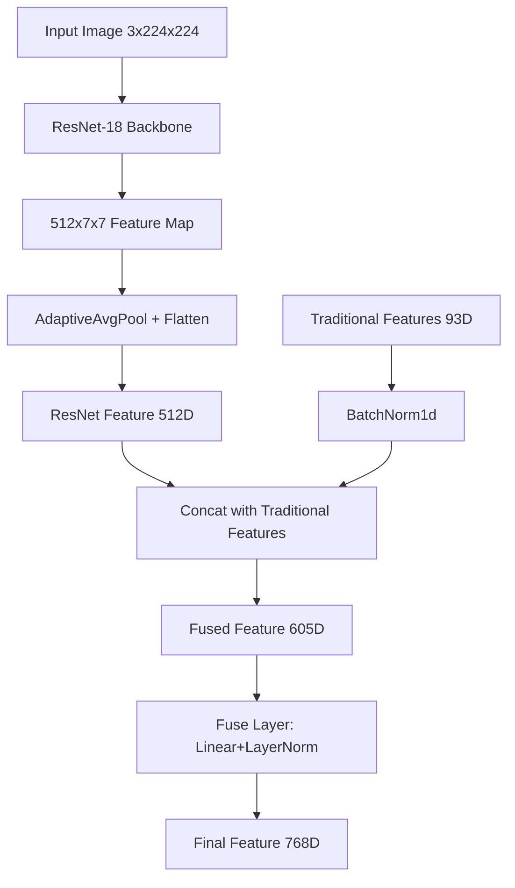
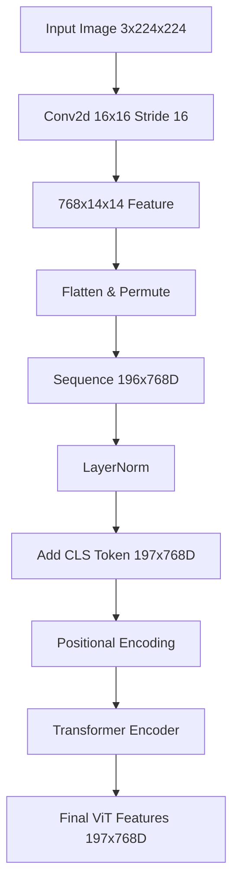

模型 radio_cnn_vit特征提取 ->交叉注意力 -> mlp分类

结构
分支一：CNN  + 传统组学特征

| 输入图像                           | 输入维度            | 输出维度        |
| ------------------------------ | --------------- | ----------- |
| 输入图像                           | (B,3,224,224)   |             |
| ResNet-18特征提取                  | (B,3,224,224)   | (B,512,7,7) |
| AdaptiveAvgPool + Flatten      | (B,512,7,7)     | (B,512)     |
| 传统特征归一化                        | (B,93)          | (B,93)      |
| 特征拼接 [ResNet, 传统特征]            | (B,512), (B,93) | (B,605)     |
| 融合层: Linear(605→768)+LayerNorm | (B,605)         | (B,768)     |

分支二：

| 输入图像                          | 输入维度          | 输出维度          |
| ----------------------------- | ------------- | ------------- |
| 输入图像                          | (B,3,224,224) |               |
| Conv2d(3→768,16x16, stride16) | (B,3,224,224) | (B,768,14,14) |
| Flatten(2) → Permute          | (B,768,14,14) | (B,196,768)   |
| LayerNorm                     | (B,196,768)   | (B,196,768)   |
| 添加CLS Token                   | (B,196,768)   | B,197,768)    |
| 加入位置编码                        | (B,197,768)   | (B,197,768)   |
| Transformer编码                 | (B,197,768)   | (B,197,768)   |
|                               |               |               |

CrossAttentionFuser模块

| ResNet特征输入                         | (B,768)                |           |
| ---------------------------------- | ---------------------- | --------- |
| Expand Dimension                   | (B,768)                | (B,1,768) |
| Cross-Attention(Q=ResNet, K/V=ViT) | (B,1,768), (B,197,768) | (B,1,768) |
| Squeeze Dimension                  | (B,1,768)              | (B,768)   |
| 获取ViT的CLS Token                    | (B,197,768)            | (B,768)   |
| 融合CLS Token与注意力输出                  | (B,768), (B,768)       | (B,768)   |
| 分类头: Linear(768→256→2)             | (B,768)                | (B,2)     |
